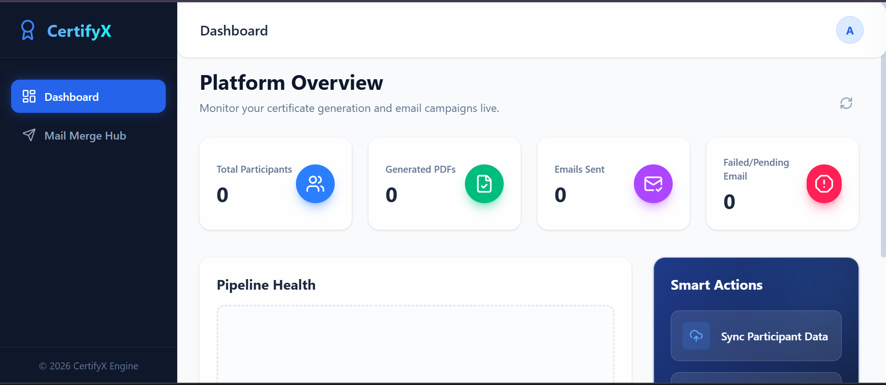
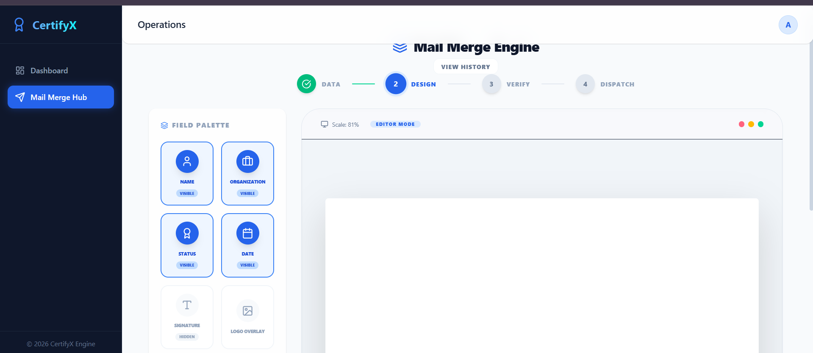

<div align="center">
  
  
  
  
  
  
</div>

<br />

<div align="center">
  <h1 align="center">🚀 CertifyX Platform</h1>
  <strong>An enterprise-grade, automated platform for designing, generating, and distributing certificates at scale.</strong>
</div>

<br />

> **CertifyX** streamlines the entire lifecycle of event certificates. From importing participant data via CSV, visually mapping data to your design templates, rendering high-fidelity PDFs, to blasting emails to thousands of participants—all managed from a sleek, high-performance React dashboard.

---

## 📑 Table of Contents

- [✨ Key Features](#-key-features)
- [🏗️ System Architecture](#️-system-architecture)
- [📸 Preview](#-preview)
- [🚀 Quick Start Guide](#-quick-start-guide)
  - [Prerequisites](#prerequisites)
  - [Installation](#installation)
- [⚙️ Environment Variables](#️-environment-variables)
- [📖 Detailed Usage](#-detailed-usage)
- [🔌 API Overview](#-api-overview)
- [📁 Project Structure](#-project-structure)
- [🤝 Contributing](#-contributing)
- [📜 License](#-license)

---

## ✨ Key Features

### 🎨 Visual Template Designer
Upload any base design (PNG/JPG) or HTML template and visually drag & drop dynamic placeholders (Name, Team, Role, Date). Customize font sizes, colors, and precise XY coordinates right from the browser.

### 📄 High-Fidelity PDF Engine
Powered by a headless Chromium instance via **Puppeteer**. It flawlessly renders your templates with web fonts, CSS transforms, and precise positioning before outputting to high-quality PDF format.

### 📊 Robust Data Pipeline
Built-in client-side **PapaParse** integration for immediate feedback. Map messy CSV columns to your certificate's required fields natively before sending the structured payload to the backend.

### ✉️ Automated Email Campaigns
Integrated **Nodemailer** module. Configure custom SMTP settings, draft personalized email bodies, attach generated PDFs automatically, and hit "Send All".

### 📈 Real-Time Telemetry
Track the lifecycle of every participant: `Pending` ➡️ `Generated` ➡️ `Sent`. Catch failures (like invalid emails) immediately and retry specific records without restarting the whole batch.

### 💾 Historical Archiving
Save past events to a local JSON datastore. View stats from previous campaigns, including total generated, success rates, and delivery failures.

---

## 🏗️ System Architecture

1. **Frontend (React/Vite)**: Handles UI state, CSV parsing, drag-and-drop template mapping, and makes RESTful calls.
2. **Backend (Node/Express)**: Manages file uploads (Multer), orchestrates Puppeteer for PDF generation, and handles the SMTP email queue.
3. **Data Store**: Uses local JSON files (`participants.json`, `settings.json`, `campaigns.json`) for zero-configuration, lightweight persistence.

---

## 📸 Preview

<div align="center">
  
  <br/><br/>
  
  <br/><br/>
  
</div>

---

## 🚀 Quick Start Guide

### Prerequisites

Ensure you have the following installed:
- **Node.js** (v18.0.0 or higher)
- **npm** or **yarn**
- **Git**

### Installation

Clone the repository and set up both environments.

```bash
# Clone the repository
git clone https://github.com/yourusername/certifyx.git
cd certifyx

# 1️⃣ Setup Backend
cd backend
npm install
npm run dev
# The backend will start on http://localhost:5000

# 2️⃣ Setup Frontend (in a new terminal)
cd ../frontend
npm install
npm run dev
# The frontend will start on http://localhost:5173
```

---

## ⚙️ Environment Variables

To fully utilize the email functionality, create a `.env` file inside the `backend` directory:

```env
# Server Port
PORT=5000

# Email SMTP Settings (For fallback/default)
EMAIL_HOST=smtp.gmail.com
EMAIL_PORT=587
EMAIL_USER=your_email@gmail.com
EMAIL_APP_PASSWORD=your_app_specific_password
```
*Note: If using Gmail, you must generate an [App Password](https://myaccount.google.com/apppasswords) as standard passwords are no longer supported.*

---

## 📖 Detailed Usage

1. **Upload Template**: Navigate to the Templates tab and upload a base image (e.g., a blank certificate design).
2. **Map Data**: Go to the Editor tab, select your template, and drag the placeholders (Name, Date, etc.) exactly where you want them.
3. **Import Participants**: Upload a CSV file. Ensure it has columns that can map to Name, Email, etc.
4. **Generate**: Hit the "Generate All" button. The backend will spin up Puppeteer and generate PDFs for everyone.
5. **Distribute**: Go to the Send tab, configure your email subject/body, and dispatch the certificates!

---

## 🔌 API Overview

The backend exposes a clean REST API. Here are the core endpoints:

| Endpoint | Method | Description |
|----------|--------|-------------|
| `/api/health` | GET | Check system status. |
| `/api/upload` | POST | Sync mapped JSON participant data. |
| `/api/generate` | POST | Trigger Puppeteer PDF generation queue. |
| `/api/send` | POST | Dispatch emails via Nodemailer. |
| `/api/templates` | GET | Fetch available templates. |
| `/api/campaigns` | GET | Retrieve archived campaigns. |

---

## 📁 Project Structure

```bash
📦 CSJ-HackAnanta Certificates
 ┣ 📂 backend
 ┃ ┣ 📂 certificates      # Output directory for generated PDFs
 ┃ ┣ 📂 src/templates     # Uploaded image bases and HTML templates
 ┃ ┣ 📜 server.js         # Express core, Puppeteer orchestration, SMTP
 ┃ ┣ 📜 package.json
 ┃ ┗ 📜 settings.json     # Dynamic JSON datastore
 ┃
 ┗ 📂 frontend
 ┃ ┣ 📂 src
 ┃ ┃ ┣ 📂 components      # Reusable UI (Modals, Tables)
 ┃ ┃ ┣ 📂 pages           # Dashboard, Editor, Data Sync
 ┃ ┃ ┣ 📜 App.jsx         # React Router setup
 ┃ ┃ ┗ 📜 index.css       # Tailwind entry point
 ┃ ┣ 📜 tailwind.config.js
 ┃ ┣ 📜 vite.config.js
 ┃ ┗ 📜 package.json
```

---

## 🤝 Contributing

We welcome contributions! To get started:
1. Fork the repository.
2. Create a new branch: `git checkout -b feature/your-feature-name`.
3. Make your changes and commit: `git commit -m 'Add some feature'`.
4. Push to the branch: `git push origin feature/your-feature-name`.
5. Submit a pull request.

---

## 📜 License

This project is proprietary. Unauthorized copying, distribution, or use of this software without explicit permission is strictly prohibited.

<br />

<div align="center">
  <i>Built with ❤️ for organizers and communities.</i>
</div>
